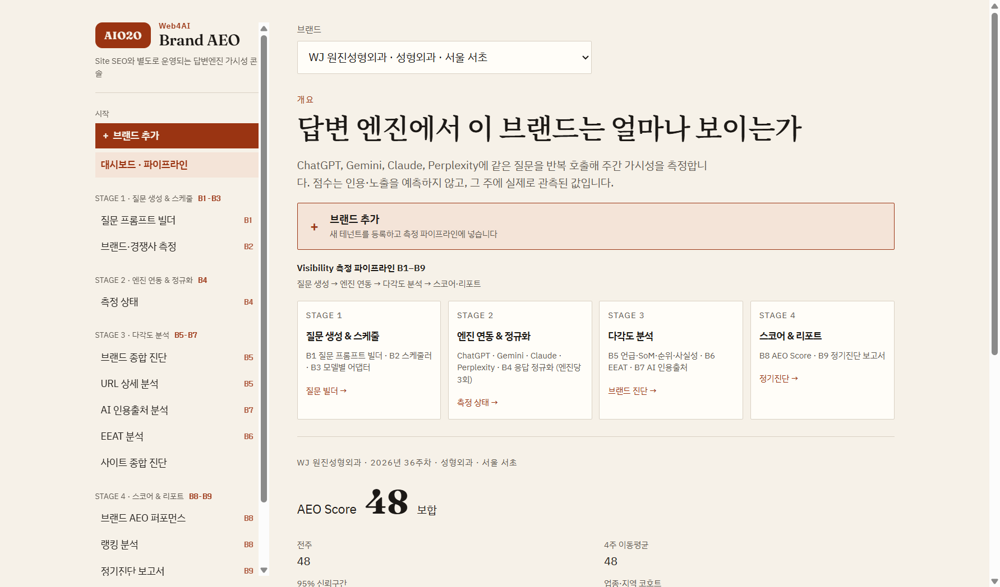
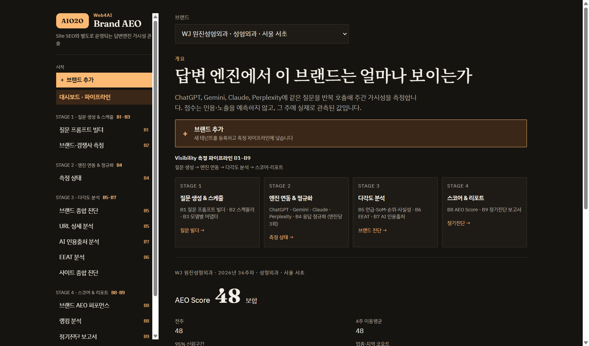
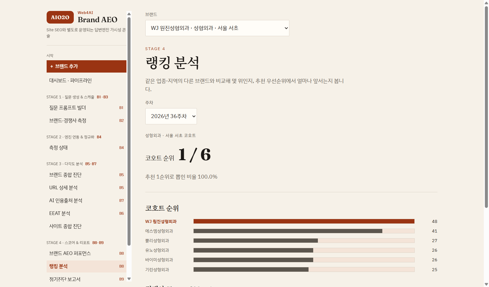
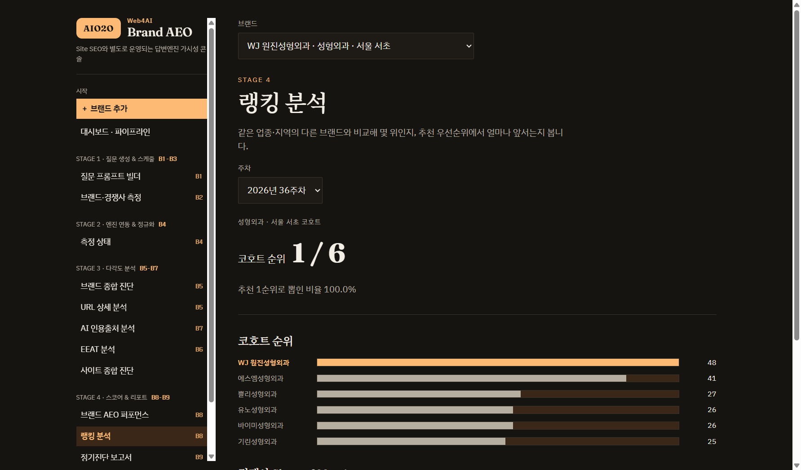

# Brand AEO — 답변 엔진 브랜드 가시성 콘솔

[](https://github.com/cablekis-alt/brand-aeo-app/releases/latest) [](LICENSE) [](https://github.com/cablekis-alt/brand-aeo-app/releases/latest)

> **데스크톱 앱 다운로드**: 위 **다운로드** 버튼 → 릴리스 페이지에서 `Web4AI Brand AEO-<버전>-x64.exe` 실행. (미서명이라 SmartScreen 경고 시 "추가 정보 → 실행")

ChatGPT·Gemini 같은 **답변 엔진(AI)에서 브랜드가 얼마나 노출·인용되는지**를 주간으로 측정하는 콘솔입니다.
같은 질문을 반복 호출해 언급률·Share of Mention·추천 순위·사실성·EEAT·인용 출처를 집계하고 AEO Score로 요약합니다.

라이트/다크/시스템 테마를 지원합니다. (왼쪽 라이트 · 오른쪽 다크)

<table>
  <tr>
    <th>라이트</th>
    <th>다크</th>
  </tr>
  <tr>
    <td></td>
    <td></td>
  </tr>
  <tr>
    <td></td>
    <td></td>
  </tr>
</table>

<sub>위: 대시보드(측정 파이프라인 개요·AEO Score) · 아래: 랭킹 분석(코호트 순위·경쟁사 비교)</sub>

- **프론트/배포**: Vite + React → Vercel (Hobby, 무료).
- **측정 파이프라인**: `server/`의 B1~B9 로직(질문 생성 → 엔진 수집 → 정규화 → 다차원 분석 → 스코어).
- **측정 실행 위치**: 로컬 PC(권장) 또는 GitHub Actions. Vercel 서버리스는 실행 시간·리전 제약으로 측정을 직접 돌리지 않습니다.

> ⚠️ **리전 주의**: 그라운딩(웹검색) 기반 추론은 요청자 리전으로 결과가 지역화됩니다. 미국 리전(Vercel iad1·GitHub 러너)에서는 한국 브랜드 회상이 부정확합니다. **한국에 있는 PC에서 측정하면 그라운딩이 정확**합니다.

---

## 셋업

```bash
npm install
```

`.env` 생성(`.env.example` 참고):

```
GEMINI_API_KEY=...
OPENAI_API_KEY=...
# 선택: 판정 엔진, 모델 오버라이드 등
JUDGE_ENGINE=gemini
```

---

## 로컬 개발

프론트(HMR)와 백엔드(Express)를 각각 띄웁니다:

```bash
npm run server:dev
```
```bash
npm run dev
```

- 프론트: `http://localhost:5173`, 백엔드 API: `http://localhost:3000`.
- 로컬 백엔드가 감지되면 앱이 **로컬 측정 모드**로 동작합니다(측정 버튼이 즉시 PC에서 실행).

---

## 로컬 측정 워크플로우 ⭐ (권장 · 운영비 0원)

한국 PC에서 필요할 때만 측정하고, 결과를 Vercel에 반영하는 흐름입니다. **상시 서버 없음 → 월 고정비 0원**, LLM API 호출 비용만 발생합니다.

### 한 방에 측정 + 반영

```bash
npm run measure:local
```

| 명령 | 동작 |
|---|---|
| `npm run measure:local` | 등록된 **모든 본 브랜드** 측정 후 Vercel 반영(인자 없으면 all) |
| `npm run measure:local -- <tenantId>` | **한 브랜드**(+ 경쟁사 코호트) 측정 후 반영 |
| `npm run measure:local -- <tenantId> --no-push` | **측정만** — 로컬 `src/data`에만, git 반영 안 함 |

> `npm`은 스크립트에 인자를 넘길 때 `--` 구분자가 필요합니다. 인자 없이 `npm run measure:local`만 실행하면 전체 측정입니다.

동작 순서:
1. `measureAndBake`로 PC에서 측정 — 경쟁사가 비면 **자동 추론**하고, 도메인 있는 경쟁사는 코호트로 함께 측정(최대 5곳).
2. 측정 산출물(`src/data/`, `server/liveRegistry.ts`, `server/tenants.config.json`)만 **`git commit` + `push`**.
3. Vercel Git 연동이 **자동 배포** → 수 분 뒤 공개 사이트에 결과 반영.

시크릿 스캔 안전장치가 있어, 키 패턴·위험 파일이 스테이징되면 중단합니다.

### 전체 흐름

```
브랜드 등록(웹 또는 로컬)  →  npm run measure:local  →  Vercel 무료 사이트에서 열람·공유
```

### 비용

| 항목 | 비용 |
|---|---|
| 상시 서버 | **0원** (없음) |
| Vercel(프론트·열람) | Hobby **무료** |
| LLM API (OpenAI·Gemini) | 측정 시에만 (어디서 돌려도 동일) |
| PC 전기·자원 | 측정 시에만 (테넌트당 ~2분) |

> 측정 비용 계수: 코호트 측정 상한 `MAX_AUTO_COHORT`(=5, `server/measureAndBake.ts`), 테넌트당 질문 수·반복·엔진 수.

---

## 데스크톱 앱 (Electron) 🖥️

한국 PC에서 **정확한 측정을 앱 하나로** 하기 위한 데스크톱 버전입니다. 웹과 **동일한 React UI**에 로컬 측정 백엔드가 내장되어, 터미널 없이 등록·측정·조회를 한 창에서 합니다. 측정 결과는 사용자 PC(`userData`)에 저장되며 git·서버가 필요 없습니다.

### 개발 모드로 실행

```bash
npm run electron:dev
```

- API 서버 + vite를 자동 기동하고 앱 창이 UI를 로드합니다. 루트 `.env`의 키를 그대로 씁니다.

### 설치본(.exe) 빌드

```bash
npm run electron:pack        # NSIS 설치본 + 포터블 .exe → dist-electron/out/
npm run electron:pack:dir    # 설치 파일 없이 앱 폴더만(빠른 확인)
```

빌드 순서: `vite build`(dist) → 서버 번들(esbuild) → electron-builder.

### 설치본 사용

1. `dist-electron/out/`의 설치본 실행 → 설치.
2. **API 키**: `GEMINI_API_KEY`가 담긴 `.env`를 실행파일과 같은 폴더 또는 `%APPDATA%\brand-aeo-app\`에 둡니다. (판정·수집 기본이 Gemini라 GEMINI 키만으로 측정됩니다.)
3. 첫 실행 시 커밋된 코호트 데이터가 **자동 시드**되어 대시보드가 바로 채워집니다. 이후 앱에서 측정하면 로컬에 누적됩니다.

- **데이터 위치**: `%APPDATA%\brand-aeo-app\`(측정 데이터·등록 브랜드·큐). 완전 초기화는 이 폴더 삭제.
- **코드 서명**: 미서명이라 설치 시 SmartScreen 경고가 뜹니다. 인증서가 있으면 `CSC_LINK`/`CSC_KEY_PASSWORD` env로 자동 서명됩니다.
- **Windows EPERM(rename) 빌드 오류** 시: `npx electron-builder --dir -c.directories.output=%TEMP%/eb-out`.

자세한 내용(구조·데이터 레이아웃·서명 절차)은 [electron/README.md](electron/README.md).

---

## 배포 (Vercel)

`master`에 push하면 Vercel Git 연동이 자동 배포합니다. 측정 데이터 커밋(`data: measure ...`)도 동일하게 자동 배포됩니다.

- **무인 주간 측정**이 필요하면 GitHub Actions(`.github/workflows/measure.yml`)를 스케줄로 병행할 수 있습니다(PC 없이 실행되지만 US 리전이라 그라운딩 품질은 로컬보다 낮음).

---

## 아키텍처

현재는 **Vercel(프론트) + 로컬/CI 측정 + Vercel Blob(런타임 상태) + git(스코어 데이터)** 하이브리드입니다.
상시 서버·실 DB로 통합하는 대안은 [docs/architecture-option-c.md](docs/architecture-option-c.md) 참고.

---

## 주요 스크립트

| 스크립트 | 용도 |
|---|---|
| `npm run dev` / `npm run server:dev` | 프론트 / 백엔드 로컬 실행 |
| `npm run measure:local [-- <target>]` | 로컬 측정 + Vercel 반영(인자 없으면 all) |
| `npm run electron:dev` | 데스크톱 앱 개발 모드 실행 |
| `npm run electron:pack` / `electron:pack:dir` | 데스크톱 설치본 / 앱 폴더 빌드 |
| `npm run build` | 프로덕션 빌드 |
| `npm run typecheck:server` | 서버 타입 체크 |
| `npm run lint` | ESLint |

---

## 라이선스

**독점 소프트웨어 — © 2026 O2O. All rights reserved.**

이 저장소의 소스·에셋·문서는 O2O의 독점·기밀 자산입니다. 저작권자의 사전 서면 허가 없이 **복제·수정·배포·2차적저작물 작성·상업적 이용을 금지**합니다. 저장소를 public으로 공개한 것은 **Web4AI Brand AEO 데스크톱 앱 배포와 참고 목적**일 뿐, 어떠한 사용 권리도 부여하지 않습니다.

전문은 [LICENSE](LICENSE) 참고. 라이선스 문의는 O2O로 연락하세요.
